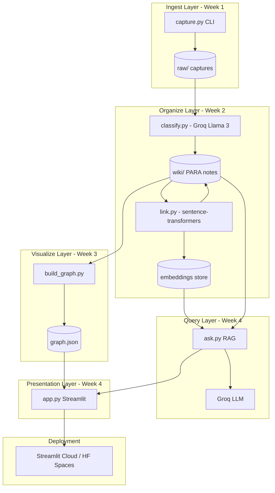
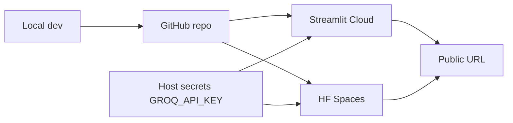

# SecondSelf — System Architecture

## 1. Vision and boundaries

**Purpose:** End-to-end personal knowledge system where captures are filed automatically, connected semantically, explored visually, and queried in natural language — deployed as one public app.

**In scope**

| Capability | Mechanism |
|------------|-----------|
| Capture | CLI/script: note, URL, file → `raw/` |
| Organize | LLM (PARA + tags + summary) → `wiki/` |
| Relate | Local embeddings + similarity threshold → wiki links |
| Visualize | `graph.json` + force-directed UI |
| Answer | Embeddings retrieval + LLM synthesis |
| Ship | Streamlit + Streamlit Cloud / HF Spaces |

**Out of scope (for v1):** Multi-user auth, real-time sync, mobile apps, collaborative editing, paid-only APIs as hard dependencies.

**Principles**

- **Filesystem as source of truth** — no DB required for MVP; JSON sidecars for metadata/embeddings if needed.
- **Week outputs feed the next week** — `raw/` → classified wiki → graph → RAG index.
- **Real data only** — design assumes messy formats (PDFs, long URLs, duplicates).

---

## 2. High-level architecture



**Control vs data plane**

- **Control:** Python scripts invoked manually or from Streamlit (“Re-index”, “Classify new”, “Rebuild graph”).
- **Data:** Markdown (or structured text) in `wiki/`, immutable-ish captures in `raw/`, derived `graph.json` and optional `data/embeddings.json` / per-note frontmatter.

---

## 3. Repository layout

```
secondself/
├── raw/                          # Immutable captures (Week 1)
│   └── {timestamp}_{uuid}.{ext|md}
├── wiki/                         # Organized notes (Week 2+)
│   └── {para}/{slug}.md          # optional PARA subfolders
├── data/                         # Derived artifacts (recommended)
│   ├── embeddings.json           # id → vector + model version
│   ├── index_manifest.json       # last run timestamps, counts
│   └── graph.json                # or root graph.json per spec
├── capture.py
├── classify.py
├── link.py
├── build_graph.py
├── ask.py
├── app.py
├── lib/                          # Shared modules (recommended)
│   ├── models.py                 # Capture, WikiNote, GraphNode/Edge
│   ├── storage.py                # read/write raw & wiki
│   ├── llm_client.py             # Groq wrapper, prompts
│   ├── embeddings.py             # encode, load, similarity
│   ├── graph_builder.py
│   └── rag.py                    # retrieve + prompt assembly
├── requirements.txt
├── .env.example                  # GROQ_API_KEY, etc.
├── README.md
└── docs/
    ├── PROBLEM_STATEMENT.md
    ├── architecture.md
    ├── implementation-plan.md
    └── edge-case.md
```

Shared logic in `lib/` avoids duplication between CLI scripts and Streamlit.

---

## 4. Core domain model

### 4.1 Capture (Week 1)

Each item in `raw/` is self-describing:

| Field | Storage |
|-------|---------|
| `id` | UUID v4 |
| `captured_at` | ISO 8601 UTC |
| `type` | `note` \| `link` \| `file` |
| `source` | optional path/URL |
| `content` | body or file copy reference |
| `mime` | for files |

**Filename convention:** `{YYYYMMDDTHHMMSSZ}_{id}.md` with YAML frontmatter + body, or `{id}` + original extension for binary copies with sidecar `.meta.yaml`.

**Capture flows**

1. **Note:** stdin or `--text "..."` → one markdown file.
2. **Link:** URL fetch optional (title snippet); store URL + optional fetched text.
3. **File:** copy into `raw/files/{id}/` or store path + hash; text extraction deferred to classify (PDF → text in classify or pre-step).

### 4.2 Wiki note (Week 2)

Promoted from raw after classification:

| Field | Source |
|-------|--------|
| `capture_id` | link back to raw |
| `para_category` | Projects \| Areas \| Resources \| Archives |
| `tags` | LLM |
| `summary` | one line |
| `title` | LLM or derived |
| `body` | cleaned content |
| `links` | `[[wiki-slug]]` or explicit IDs from link.py |
| `embedding_id` | key in embeddings store |

**PARA mapping (logical)**

- **Projects:** time-bound outcomes.
- **Areas:** ongoing responsibilities.
- **Resources:** reference material.
- **Archives:** inactive / completed.

Wiki files: Markdown + YAML frontmatter for machine readability and graph building.

### 4.3 Graph (Week 3)

```json
{
  "meta": { "generated_at": "...", "note_count": 42, "edge_count": 87 },
  "nodes": [
    { "id": "wiki-slug", "label": "Title", "para": "Resources", "summary": "..." }
  ],
  "edges": [
    { "source": "a", "target": "b", "type": "similarity", "weight": 0.82 }
  ]
}
```

**Edge types:** `explicit_link` (markdown wikilinks), `similarity` (embedding threshold), optionally `same_capture_chain`.

### 4.4 RAG context (Week 4)

Retrieval unit: **wiki note** (or chunk if notes are long — see §8).

`ask(question)` returns:

- `answer` (LLM)
- `sources[]` (note ids, snippets, scores)
- optional `graph_highlight` (node ids for UI)

---

## 5. Component design

### 5.1 `capture.py` (Week 1)

**Interface**

```bash
python capture.py note "idea..."
python capture.py link "https://..."
python capture.py file ./path/to/doc.pdf
```

**Responsibilities**

- Parse CLI args; generate `id` + timestamp.
- Normalize encoding (UTF-8).
- For files: copy + record metadata; do not block on PDF parse.
- Append to optional `raw/index.jsonl` for fast listing.

**Dependencies:** `uuid`, `datetime`, `pathlib`, `argparse`; optional `requests` for link titles.

### 5.2 `classify.py` (Week 2.1)

**Pipeline:** list unprocessed raw → for each, build prompt → Groq (Llama 3) → parse structured JSON → write/update `wiki/`.

**LLM contract (structured output)**

```json
{
  "para_category": "Resources",
  "tags": ["python", "rag"],
  "summary": "One line.",
  "title": "Short title"
}
```

**Prompt design:** include PARA definitions + truncated content (token budget); instruct JSON-only response with retry on parse failure.

**Idempotency:** track `classified_capture_ids` in `data/index_manifest.json`; skip or `--force` reclassify.

**Module split:** `lib/llm_client.py` (API, retries, rate limits), `lib/prompts.py`.

### 5.3 `link.py` (Week 2.2)

**Embedding model:** `sentence-transformers` (e.g. `all-MiniLM-L6-v2`) — local, free.

**Algorithm**

1. Load all wiki notes; compute or load cached embedding per `note_id`.
2. For each note (especially new/changed), cosine similarity vs all others.
3. If `similarity >= T` (e.g. 0.75–0.85, tunable), add bidirectional link in frontmatter + append `[[related-slug]]` in body or a `## Related` section.
4. Persist `data/embeddings.json` with model name + dimension for invalidation on model change.

**Complexity:** O(n²) acceptable for hundreds of notes; for scale, use approximate NN (future).

**Dedup:** cap links per note (e.g. top 5 above threshold) to avoid hairball graphs.

### 5.4 `build_graph.py` (Week 3.1)

**Inputs:** all `wiki/*.md` (recursive), frontmatter `links`, optional similarity edges from link metadata.

**Process**

1. Parse markdown + frontmatter (`python-frontmatter` or custom).
2. Build node list (id = slug/path).
3. Build edges from wikilinks + similarity records.
4. Validate: no orphan policy optional; drop broken link targets or create stub nodes (config flag).
5. Write `graph.json` (or `data/graph.json`).

### 5.5 Interactive graph (Week 3.2 → embedded in Streamlit)

**Library choice**

| Option | Pros |
|--------|------|
| **vis-network** | Fast to embed in Streamlit via `st.components.v1.html` |
| **Cytoscape.js** | Rich styling, heavier setup |

**UI behaviors**

- Force-directed layout; physics toggle.
- Hover: summary + first N chars of body (from JSON node payload or lazy load).
- Click: optional sidebar detail in Streamlit.
- Drag, zoom, fit — pass through library defaults.

**Data path:** Streamlit reads `graph.json` at startup or on “Refresh graph” button.

### 5.6 `ask.py` (Week 4.1) — RAG

```text
question
   → embed question (same model as notes)
   → top-k wiki notes by cosine similarity (k=3–8)
   → assemble context block (title, summary, excerpt)
   → Groq LLM with system prompt: "Answer only from context; cite note titles; say if unknown"
   → return answer + sources
```

**Module:** `lib/rag.py` — `retrieve()`, `synthesize()`, public `ask()`.

**Guardrails:** max context tokens; truncate long notes by section; temperature low for factual synthesis.

### 5.7 `app.py` (Week 4.2) — Streamlit shell

**Layout (suggested)**

- Sidebar: stats (# notes, last classify/link/graph run), actions (run pipelines — with warnings in cloud).
- Tab 1: **Brain** — embedded graph component.
- Tab 2: **Ask** — text input + answer + source expanders.
- Optional Tab 3: **Capture** — text area + URL + file upload → calls capture logic (writes to repo path or temp — **deployment constraint**: cloud may need persistent volume or Git-backed storage; see §9).

**Orchestration on deploy:** pre-build `wiki/`, `graph.json`, embeddings in repo or build step in CI; runtime “full pipeline” may be too slow for serverless free tier.

---

## 6. Data flow (end-to-end)

```text
1. User: capture.py → raw/{id}
2. User: classify.py → wiki/{para}/{slug}.md
3. User: link.py → updates wiki links + embeddings.json
4. User: build_graph.py → graph.json
5. User: app.py loads graph.json; ask.py uses wiki + embeddings
6. Deploy: same artifacts + secrets on host
```

**Streamlit session:** read-only Q&A + graph; optional “Rebuild index” triggers subprocess or imported functions (watch timeouts on HF/Streamlit Cloud).

---

## 7. Technology stack

| Layer | Choice | Rationale |
|-------|--------|-----------|
| Language | Python 3.10+ | Course scripts + ML ecosystem |
| LLM | Groq + Llama 3 | Free tier, fast inference |
| Embeddings | sentence-transformers | Local, no API cost |
| Wiki format | Markdown + YAML | Human-readable, git-friendly |
| Graph UI | vis-network or Cytoscape.js | HTML component in Streamlit |
| App | Streamlit | Spec requirement; rapid UI |
| Deploy | Streamlit Cloud / HF Spaces | Public URL, free |
| Secrets | `.env` / host secrets | `GROQ_API_KEY` |

**requirements.txt (conceptual):** `streamlit`, `groq` (or OpenAI-compatible client), `sentence-transformers`, `torch` (CPU), `pyyaml`, `python-frontmatter`, `requests`, optional `pypdf` for PDF text in classify.

---

## 8. Cross-cutting concerns

### 8.1 Configuration

Single `config.yaml` or env vars:

- `RAW_DIR`, `WIKI_DIR`, `DATA_DIR`
- `SIMILARITY_THRESHOLD`, `TOP_K_RAG`, `EMBEDDING_MODEL`
- `GROQ_MODEL`, `MAX_TOKENS`

### 8.2 Observability

- Structured logging to stdout (capture id, classify status, link pairs created).
- `data/index_manifest.json`: counts, errors, last successful run.

### 8.3 Long documents

- Chunk notes (512–1024 tokens) with chunk ids in embeddings store; RAG retrieves chunks then dedupe by note.
- Week 2 MVP: whole-note embedding is acceptable for short personal notes.

### 8.4 Link and file extraction

- Week 1: store URL; Week 2 classify may fetch readable text (timeout, User-Agent).
- PDFs: extract text in classify via `pypdf`; if empty, summary from filename + user note.

---

## 9. Deployment architecture



**Important deployment choices**

1. **Bundled knowledge:** Commit sample `wiki/`, `graph.json`, embeddings (or generate in Dockerfile/build script) so the public app works without writing to ephemeral disk.
2. **Capture on cloud:** File uploads can write to `/tmp` but won’t persist across restarts unless you use external storage (S3, GitHub API) — v1 can document “capture locally, deploy read-only brain.”
3. **Cold start:** sentence-transformers model load — cache in Docker image or HF Space hardware with enough RAM.
4. **API keys:** never in repo; Streamlit Secrets TOML.

---

## 10. Security and privacy

- Personal notes in repo: use **private GitHub** until sanitized; public deploy only with data you’re willing to expose.
- Groq: user content leaves machine to API — document in README.
- No auth on public URL means **do not deploy raw private captures** without access control (future: password gate in Streamlit).

---

## 11. Testing strategy

| Layer | Test approach |
|-------|----------------|
| Capture | CLI integration: note/link/file → assert frontmatter + files exist |
| Classify | Mock LLM JSON; one real Groq smoke test |
| Link | Fixed two-note fixture → assert edge above threshold |
| Graph | Golden `graph.json` from fixture wiki |
| RAG | Question with known note → assert source id in response |
| E2E | Script: capture → classify → link → graph → ask one question |

---

## 12. Milestone mapping (4 weeks)

| Week | Badge | Architectural deliverable |
|------|--------|---------------------------|
| 1 | Archivist | Ingest API + `raw/` schema + index |
| 2 | Librarian | LLM classify pipeline + embedding linker + `wiki/` |
| 3 | Cartographer | Graph builder + JSON schema + interactive renderer |
| 4 | Oracle | RAG `ask()` + Streamlit composition + cloud deploy |

---

## 13. Future extensions (post-MVP)

- SQLite / LanceDB for embeddings and full-text search.
- Incremental graph updates without full rebuild.
- Obsidian-compatible wiki links.
- Scheduled “inbox zero” job for new raw items.
- Multi-modal embeddings for images in captures.
