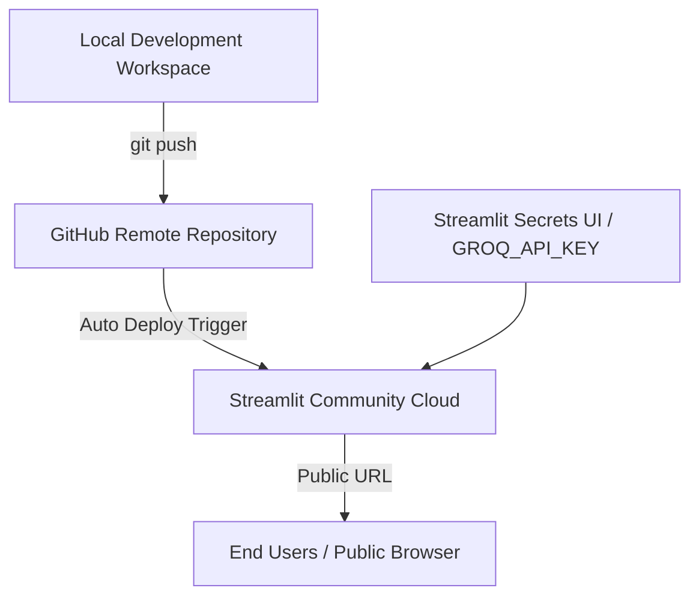

# SecondSelf — Streamlit Deployment Plan

This document outlines the step-by-step production deployment strategy for **SecondSelf** (Personal AI Second Brain) to **Streamlit Community Cloud** (and Hugging Face Spaces fallback), covering build configuration, secret management, performance optimization, and post-deploy verification.

---

## 1. Overview & Architecture Reference

- **Deployment Target**: Streamlit Community Cloud (`share.streamlit.io`) / Hugging Face Spaces
- **Main Application Script**: [app.py](file:///Users/Shared/Files%20From%20e.localized/External/Second%20Brain/app.py)
- **Primary Dependencies**: Python 3.10+, `streamlit`, `groq`, `sentence-transformers`, `torch` (CPU), `pyyaml`, `python-frontmatter`, `numpy`
- **Architecture References**: [Docs/architecture.md](./architecture.md) §9 (Deployment Architecture) & §10 (Security & Privacy)



---

## 2. Pre-Deployment Readiness & Repository Cleanup

Before connecting the repository to Streamlit Cloud, complete the following pre-flight checks:

### 2.1 Bundled Data Pre-Baking
Since Streamlit Cloud runs on ephemeral containers (filesystem changes reset on restart), pre-bake all pre-computed assets into Git:
- [x] **Wiki Directory**: Ensure populated `wiki/` (`Projects/`, `Areas/`, `Resources/`, `Archives/`) notes are committed.
- [x] **Pre-Computed Graph**: Ensure [data/graph.json](file:///Users/Shared/Files%20From%20e.localized/External/Second%20Brain/data/graph.json) and root `graph.json` are committed.
- [x] **Cached Embeddings**: Ensure [data/embeddings.json](file:///Users/Shared/Files%20From%20e.localized/External/Second%20Brain/data/embeddings.json) is committed so cold-starts do not require re-indexing.

### 2.2 Security & Data Privacy Audit
- [x] **Secrets Exclusion**: Verify `.env` is listed in [.gitignore](file:///Users/Shared/Files%20From%20e.localized/External/Second%20Brain/.gitignore) and NOT tracked in Git.
- [x] **Sanitization**: Ensure no private passwords, personal tokens, or unredacted confidential personal data are present in committed `raw/` or `wiki/` notes.
- [x] **Git Tracking Check**:
  ```bash
  git status
  git check-ignore .env
  ```

---

## 3. Host Configuration & Secrets Setup

### 3.1 Environment Secrets (Streamlit Cloud UI)
On Streamlit Community Cloud, configure secret variables under **App Settings ➔ Secrets**:

```toml
# Streamlit Community Cloud Secrets Format
GROQ_API_KEY = "gsk_your_actual_groq_api_key_here"
GROQ_MODEL = "llama-3.3-70b-versatile"
EMBEDDING_MODEL = "all-MiniLM-L6-v2"
SIMILARITY_THRESHOLD = 0.78
TOP_K_RAG = 5
```

> [!IMPORTANT]
> Never commit actual API keys to `secrets.toml` in public Git repositories. Local development uses [.env](file:///Users/Shared/Files%20From%20e.localized/External/Second%20Brain/.env).

### 3.2 Dependency Pinning ([requirements.txt](file:///Users/Shared/Files%20From%20e.localized/External/Second%20Brain/requirements.txt))
Verify CPU-only Torch and lightweight dependencies to prevent cloud build timeouts:

```text
streamlit>=1.30.0
groq>=0.4.0
sentence-transformers>=2.2.2
torch --extra-index-url https://download.pytorch.org/whl/cpu
pyyaml>=6.0
python-frontmatter>=1.0.0
requests>=2.31.0
numpy>=1.24.0
pypdf>=3.17.0
```

---

## 4. Resource Optimization & Memory Protection

Streamlit Community Cloud imposes a **1 GB RAM limit** for free apps. To ensure reliable performance:

### 4.1 Resource Caching in [app.py](file:///Users/Shared/Files%20From%20e.localized/External/Second%20Brain/app.py)
- Use `@st.cache_resource` for the `SentenceTransformer` model initialization to avoid reloading weights on every user interaction.
- Use `@st.cache_data` for loading [data/graph.json](file:///Users/Shared/Files%20From%20e.localized/External/Second%20Brain/data/graph.json) and [data/embeddings.json](file:///Users/Shared/Files%20From%20e.localized/External/Second%20Brain/data/embeddings.json).

### 4.2 Cloud Execution Mode
- **Read-Only Default**: In cloud deployment, brand the Capture tab with a notice indicating that live captures written on cloud instances are transient unless synced to a persistent volume or external repository.

---

## 5. Step-by-Step Deployment Instructions

### Step 1: Push Clean Code to GitHub
```bash
git add .
git commit -m "feat: prepare production build for Streamlit Cloud deployment"
git push origin main
```

### Step 2: Create App on Streamlit Community Cloud
1. Log in to [share.streamlit.io](https://share.streamlit.io/) using GitHub OAuth.
2. Click **New app**.
3. Select your repository: `<your-username>/Second-Self` (or current active repo).
4. Set **Branch**: `main`.
5. Set **Main file path**: `app.py`.
6. Set **App URL** custom slug (optional): `secondself-brain`.

### Step 3: Enter Secrets & Advanced Settings
1. Click **Advanced Settings**.
2. Select **Python Version**: `3.10` or `3.11`.
3. In the **Secrets** text block, paste the TOML configuration:
   ```toml
   GROQ_API_KEY = "your-groq-api-key"
   ```
4. Click **Save**.

### Step 4: Deploy & Monitor Build Logs
1. Click **Deploy!**.
2. Monitor the deployment terminal log in the lower-right corner.
3. Verify successful `pip install` and initial module initialization.

---

## 6. Post-Deployment Verification Matrix

Run the following validation checklist against the live public URL:

| Test Item | Verification Procedure | Expected Outcome | Pass/Fail |
| :--- | :--- | :--- | :---: |
| **App Launch** | Open live URL in a fresh incognito browser tab. | Page loads cleanly without 500 error or OOM crash. | [ ] |
| **Graph Visualizer** | Navigate to **Brain** tab; drag, zoom, and hover over nodes. | Interactive force-directed `vis-network` graph renders with note tooltips. | [ ] |
| **RAG Ask Query** | Navigate to **Ask** tab; query `"What is system architecture?"`. | Synthesizes response citing source notes (e.g. `[Note Title]`). | [ ] |
| **Source Expanders** | Click on retrieved source note expanders under answer. | Expands preview with similarity match score and note summary. | [ ] |
| **Secrets Protection** | Check browser dev tools & HTML source code. | No exposure of `GROQ_API_KEY` or environment credentials. | [ ] |

---

## 7. Contingency & Fallback Plans

### 7.1 Out-Of-Memory (OOM) Mitigation
- **Symptom**: Streamlit app restarts repeatedly or crashes with `MemoryLimitExceeded`.
- **Fix**: Switch embedding model to `paraphrase-MiniLM-L3-v2` or pre-convert note vectors into quantized embeddings.

### 7.2 Groq Rate Limit / Outage Fallback
- **Symptom**: `ask()` returns API error.
- **Fix**: `lib/rag.py` fallback handles Groq client exceptions gracefully and displays context notes directly to user with warning message.

### 7.3 Alternative Deployment: Hugging Face Spaces
If Streamlit Cloud RAM proves restrictive:
1. Create a new Space on [Hugging Face Spaces](https://huggingface.co/spaces).
2. Choose **Streamlit** SDK.
3. Add `GROQ_API_KEY` under **Space Settings ➔ Repository Secrets**.
4. Push repo contents to Hugging Face Git remote.
